# 🏠 Active Directory Home Lab Using Oracle VirtualBox

This project guides you step-by-step through setting up a Windows Active Directory home lab environment using Oracle VirtualBox. Ideal for IT Support professionals and students preparing for real-world experience.

---

## Diagram of project:

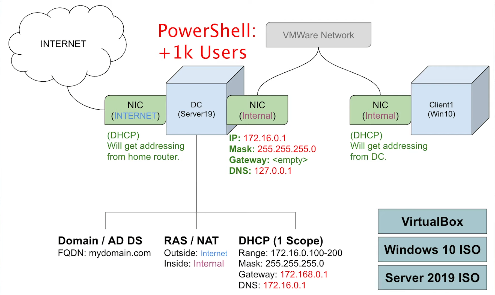
photo credit: [Josh Madakor](https://youtu.be/MHsI8hJmggI?si=5vCUiAvUFuN-byRg)

---

## 📥 1. Download & Install Required Software

### 🔧 Oracle VirtualBox
- [Download VirtualBox](https://www.virtualbox.org/wiki/Downloads)
- Install:
  - **Windows Hosts** package
    
    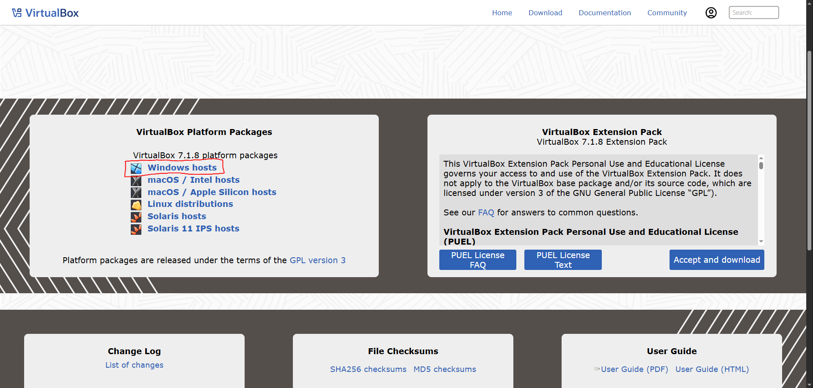
  - **Extension Pack**
    
    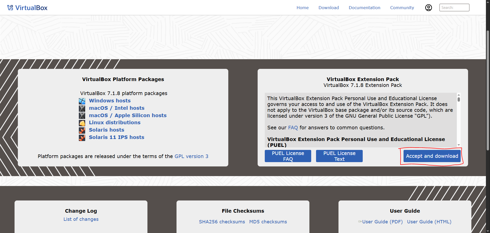

### 💿 ISOs Needed
- [Windows Server 2019 ISO](https://www.microsoft.com/en-us/evalcenter/download-windows-server-2019)
- [Windows 10 ISO](https://www.microsoft.com/en-us/software-download/windows10)

---

## 🖥️ 2. Set up Domain Controller Virtual Machine

### VM Setup
- Name: `Domain Controller`
- Memory & CPU: Allocate comfortably (e.g., 4GB RAM, 4 CPUs)
- Clipboard & Drag'n'Drop: **Bidirectional**
- Network:
  - **Adapter 1**: NAT
  - **Adapter 2**: Internal Network (e.g., `intnet`)
- Mount the **Windows Server 2019 ISO**
  
  

### Install Windows Server 2019
- Edition: **Standard Evaluation (Desktop Experience)**
- Type: **Custom: Install Windows only**
- Admin password: `Password1`
- Rename PC to `DC`

### Network Configuration
Rename adapters:
- NAT → `INTERNET`
- Internal → `_INTERNAL`

Set static IP for `_INTERNAL`:
```
IP: 172.16.0.1
Subnet: 255.255.255.0
Gateway: (leave blank)
DNS: 127.0.0.1
```


Then restart the DC (Domain Controller) PC.

---

## 🧱 3. Install & Configure Active Directory

### Add Role
- **Server Manager** → Add Roles and Features
- Select: **Active Directory Domain Services**
  
  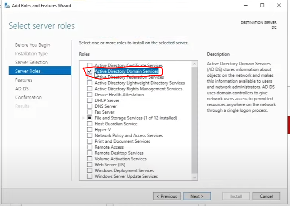

### Promote Server
- Click ⚠️ flag → **Promote this server to a domain controller**
- Deployment: **Add a new forest**
- Root domain: `mydomain.com`
- Password: `Password1`
  
  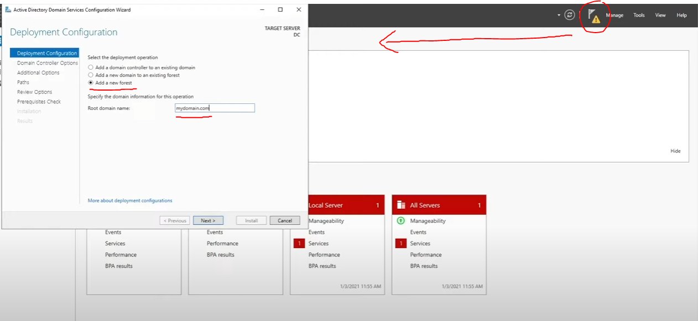

- Install and complete, then sign back in

---

## 👥 4. Create Domain Admin Account

- Open **Active Directory Users and Computers**
- Create Organizational Unit: `_ADMINS`
- Add user:
  - First Name & Last Name
  - Username: `a-<firstinitial><lastname>` (e.g., `a-jdoe`)
  - Password: `Password1`
  - Settings: Uncheck "User must change password", check "Password never expires"
- Add user to group: `Domain Admins`
  
  

- Sign out and sign in with new domain account

---

## 🌐 5. Configure NAT & DHCP

### Enable NAT
- Add Role: **Remote Access** → Include **Routing**
  
  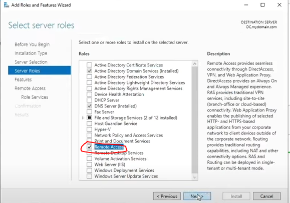
  
  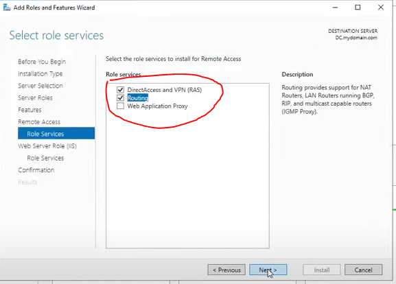
- Open **Routing and Remote Access**
- Right-click DC → Configure and Enable Routing and Remote Access:
  
  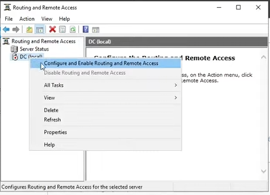
  - Type: **NAT**
    
    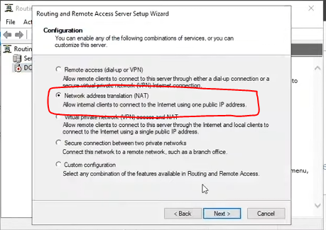
  - Public interface: `INTERNET`
    
    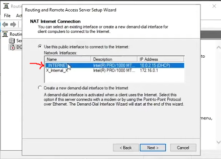

### Configure DHCP
- Add Role: **DHCP Server**
  
  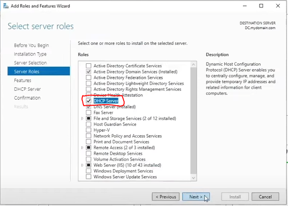
- Open DHCP → IPv4 → New Scope:
  - Name: `172.16.0.100-200`
  - IP Range: `172.16.0.100` - `172.16.0.200`
  - Subnet: `255.255.255.0`
  - Router: `172.16.0.1`
  - Domain: `mydomain.com` & `172.16.0.1`
- Activate scope, authorize and refresh
  
  

Server Options - Router:

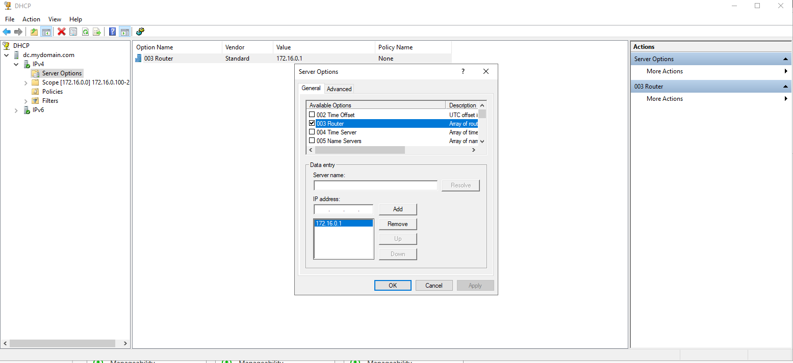

---

## 🔄 6. Create Test Users with PowerShell

- Create a text file on the Desktop:

```powershell
$PASSWORD_FOR_USERS = "Password1"
$password = ConvertTo-SecureString $PASSWORD_FOR_USERS -AsPlainText -Force

$firstNames = @("James", "Mary", "John", "Patricia", "Robert", "Jennifer", "Michael", "Linda", "William", "Elizabeth", "David", "Barbara", "Richard", "Susan", "Joseph", "Jessica", "Thomas", "Sarah", "Charles", "Karen")
$lastNames = @("Smith", "Johnson", "Williams", "Brown", "Jones", "Garcia", "Miller", "Davis", "Rodriguez", "Martinez", "Hernandez", "Lopez", "Gonzalez", "Wilson", "Anderson", "Thomas", "Taylor", "Moore", "Jackson", "Martin")

$USER_FIRST_LAST_LIST = for ($i = 0; $i -lt 1000; $i++) {
    "$($firstNames | Get-Random) $($lastNames | Get-Random)"
}

New-ADOrganizationalUnit -Name _USERS -ProtectedFromAccidentalDeletion $false -ErrorAction SilentlyContinue

foreach ($n in $USER_FIRST_LAST_LIST) {
    $first = $n.Split(" ")[0].ToLower()
    $last = $n.Split(" ")[1].ToLower()
    $username = "$($first.Substring(0,1))$($last)".ToLower()

    New-AdUser -AccountPassword $password `
               -GivenName $first `
               -Surname $last `
               -DisplayName $username `
               -Name $username `
               -EmployeeID $username `
               -PasswordNeverExpires $true `
               -Path "ou=_USERS,$(([ADSI]'').distinguishedName)" `
               -Enabled $true
}
```

- Save as `CREATE_USERS.ps1` on Desktop
- Run Windows Powershell ISE as Administrator
- Open script `CREATE_USERS.ps1`
- Enter `Set-ExecutionPolicy Unrestricted` in the terminal
- Run Script
  
  

---

## 🧑‍💻 7. Set Up CLIENT1 Virtual Machine

### VM Setup
- Name: `CLIENT1`
- Memory & CPU: Allocate comfortably (e.g., 4GB RAM, 4 CPUs)
- Clipboard & Drag'n'Drop: **Bidirectional**
- Network: **Internal Network**
- Mount **Windows 10 ISO**
  
  

### Install Windows 10
- No product key → **Windows 10 Pro x64**
- Type: **Custom: Install Windows only**
- Choose: **I don’t have internet** → **Continue with limited setup**
- Username: `user`, leave password blank
- Skip all additional settings

### Network Testing
- Run in cmd (Command Prompt):
  ```
  ipconfig /all
  ping www.google.com
  ```
  
  

- If Default Gateway is missing:
  - Check DHCP settings on the Domain Controller Virtual Machine 
  - Ensure router IP `172.16.0.1` is configured under Server Options
  - Restart DHCP service
  - On CLIENT1: `ipconfig /renew` and test network again

- If `ping www.google.com` gives `Ping request could not find host www.google.com. Please check the name and try again.`:
  - Check DHCP settings on the Domain Controller Virtual Machine 
  - Ensure DNS Servers IP `172.16.0.1` is configured under Scope Options
  - Restart DHCP service
  - On CLIENT1: `ipconfig /renew` and test network again with `ping www.google.com` 

---

## 🖥️ 8. Join CLIENT1 to Domain

### Join Domain
- On CLIENT1, Right-click Start → System → Rename this PC (Advanced)
- Rename: `CLIENT1`
- Join domain: `mydomain.com`
- Provide domain admin credentials (e.g., `a-jdoe` / `Password1`)
- Restart
- Log in via **Other user** using a domain account
  
  

---

## 🔎 9. Verify Setup

### On the Domain Controller Virtual Machine:
- **DHCP** → IPv4 → Address Leases → Confirm `CLIENT1` listed
- **Active Directory Users and Computers** → Domain → Computers → Confirm `CLIENT1` listed
  
  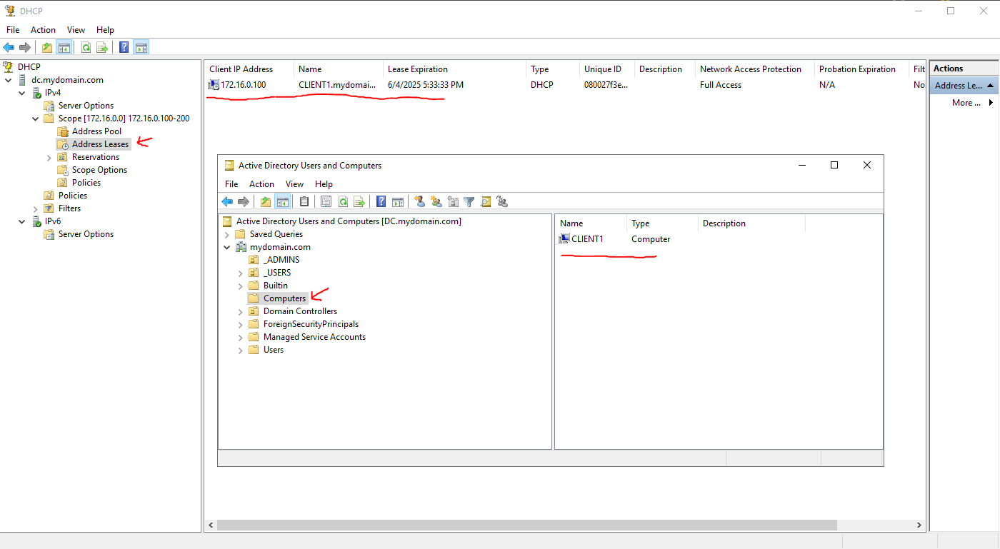

---

<div align="left">
  <a href="kennymiranda000@gmail.com" target="_blank">
    
  </a>
  <a href="https://www.linkedin.com/in/kenneth-miranda-xyz" target="_blank">
    
  </a>
</div>
